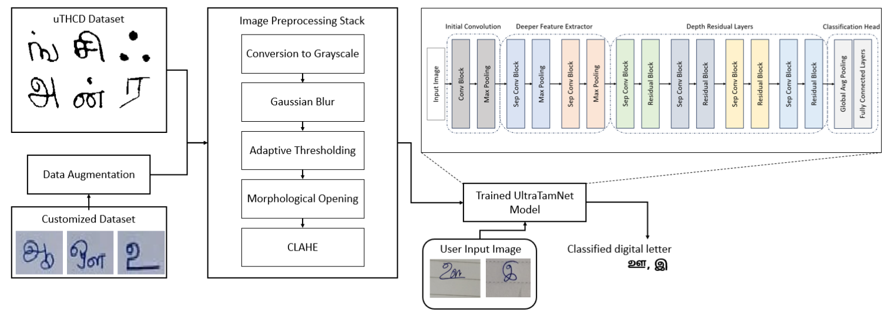
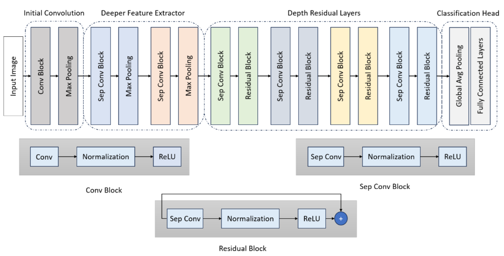
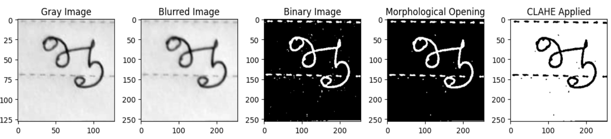
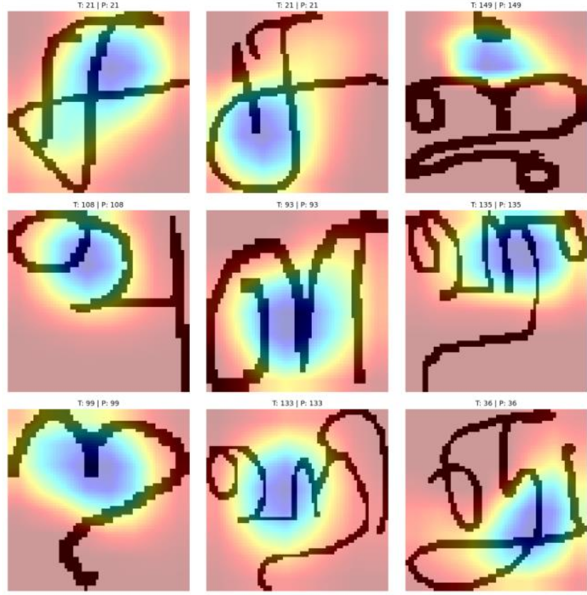

# UltraTamNet: A Lightweight Tamil-Optimized Deep Learning Architecture for Handwritten Character Recognition

**Authors:** Rajesh Kannan Megalingam, Prasannahariveeresh Jeyaveerapandian Raji  
**Affiliation:** HuT Labs, Department of Electronics and Communication Engineering, Amrita Vishwa Vidyapeetham, Amritapuri, India


## Overview

Tamil is one of India's oldest classical languages, with a script of 247 characters featuring circular loops, horizontal/vertical strokes, and complex curves that make handwritten character recognition particularly challenging. Existing deep learning models achieve high accuracy but demand heavy computation, limiting deployment on edge devices.

**UltraTamNet** is a Tamil-optimized lightweight hybrid CNN that combines:
- **Depthwise Separable Convolutions** — for efficient stroke-level feature extraction with fewer parameters
- **Residual Skip Connections** — for stable gradient propagation through deeper layers without projection shortcuts
- **Multi-stage feature hierarchy** — capturing low-level edges up to high-level glyph representations

UltraTamNet achieves **98.22% test accuracy** on the public uTHCD dataset while maintaining only **1.27M parameters** and **167M FLOPs** — outperforming all 11 SOTA baselines including ResNet50, DenseNet169, and MobileNetV2.



## Architecture



| Stage  | Layer Type | Kernel | Filters | Output Size  |
|--------|------------|--------|---------|--------------|
| Input  | —          | —      | —       | 64×64×1      |
| CB     | Conv2D     | 5×5    | 32      | 64×64×32     |
|        | MaxPool    | 2×2    | —       | 32×32×32     |
| SCB1   | SepConv    | 3×3    | 64      | 32×32×64     |
|        | MaxPool    | 2×2    | —       | 16×16×64     |
| SCB2   | SepConv    | 3×3    | 128     | 16×16×128    |
|        | MaxPool    | 2×2    | —       | 8×8×128      |
| Deep1  | SepConv + Residual | 3×3 | 256 | 8×8×256   |
| Deep2  | SepConv + Residual | 3×3 | 256 | 8×8×256   |
| Deep3  | SepConv + Residual | 3×3 | 512 | 8×8×512   |
| Deep4  | SepConv + Residual | 3×3 | 512 | 8×8×512   |
| Head   | GAP + Dense | —     | —       | 156 (or 12)  |


## Datasets

### Dataset 1 — uTHCD (Public Benchmark)
- **Name:** Unconstrained Tamil Handwritten Character Database (uTHCD)
- **Source:** [Kaggle — faizalhajamohideen/uthcdtamil-handwritten-database](https://www.kaggle.com/datasets/faizalhajamohideen/uthcdtamil-handwritten-database)
- **Size:** 91,000+ single-character images across **156 classes** (vowels, consonants, vowel-consonant combinations)
- **Image size:** 64×64 grayscale
- **Split:** 80% train / 10% test / 10% validation (writer-independent)
- **Used for:** Table 3 (model comparison), ablation study
- **Citation:** N. Shaffi and F. Hajamohideen, "uTHCD: A New Benchmarking for Tamil Handwritten OCR," in IEEE Access, vol. 9, pp. 101469-101493, 2021, doi: 10.1109/ACCESS.2021.3096823.

### Dataset 2 — Custom Tamil Vowel Dataset (Authors' Dataset)
- **Name:** Custom handwritten Tamil vowel dataset
- **Collection:** 50 volunteers of various ages and handwriting styles; written on 6×10 grid paper, scanned at 300 DPI
- **Size:** 600 raw images (50 samples × 12 classes), expanded via augmentation
- **Classes (12):** அ ஆ இ ஈ உ ஊ எ ஏ ஐ ஒ ஓ ஔ *(Tamil Uyir Ezhuthu — pure vowels)*
- **Used for:** Table 6 (augmentation study), LOVO generalization test
- **Used for:**

**Preprocessing pipeline applied to the custom dataset:**



## Key Results

### Table 3 — Model Comparison on uTHCD (156 classes)

| Model            | Category       | Test Acc (%) | Test Loss | F1-Score | Params (M) | FLOPs (M) |
|------------------|----------------|--------------|-----------|----------|------------|-----------|
| ResNet50         | CNN            | 97.81        | 0.0838    | 0.978    | 23.9       | 620       |
| DenseNet169      | CNN            | 97.42        | 0.1066    | 0.975    | 12.0       | 540       |
| DenseNet121      | CNN            | 97.50        | 0.080     | 0.975    | 7.2        | 453       |
| EfficientNetB0   | Lightweight    | 96.17        | 0.130     | 0.963    | 4.24       | 65        |
| EfficientNetB5   | Lightweight    | 97.50        | 0.114     | 0.974    | 28.8       | 402       |
| LeNet-5          | Baseline       | 92.83        | 0.296     | 0.929    | 2.48       | 0.83      |
| MobileNetV2      | Lightweight    | 97.30        | 0.091     | 0.973    | 2.45       | 49        |
| MobileNetV3Small | Lightweight    | 96.64        | 0.143     | 0.967    | 1.03       | 10        |
| MobileNetV3Large | Lightweight    | 95.85        | 0.177     | 0.959    | 3.14       | 39        |
| NASNetMobile     | Lightweight    | 95.69        | 0.166     | 0.956    | 4.43       | 93        |
| Xception         | CNN            | 96.17        | 0.141     | 0.960    | 21.18      | 1105      |
| **UltraTamNet (Ours)** | **Tamil-Optimized** | **98.22** | **0.069** | **0.982** | **1.27** | **167** |

### Table 6 — Augmentation Study on Custom Tamil Vowel Dataset (12 classes)

| Model       | Aug Multiple | Train Acc (%) | Test Acc (%) | Test Loss | Precision (%) | Recall (%) | F1-Score (%) |
|-------------|-------------|---------------|--------------|-----------|---------------|------------|--------------|
| ResNet50    | ×4          | 94.21 | 92.21 | 0.24 | 92.24 | 92.61 | 92.42 |
|             | ×6          | 96.67 | 94.81 | 0.17 | 94.10 | 94.94 | 94.52 |
|             | ×8          | 97.73 | 95.42 | 0.12 | 95.80 | 95.64 | 95.72 |
|             | ×10         | 98.24 | 96.80 | 0.09 | 96.50 | 96.80 | 96.65 |
| MobileNetV2 | ×4          | 96.32 | 92.49 | 0.30 | 94.50 | 91.98 | 93.22 |
|             | ×6          | 98.64 | 98.75 | 0.05 | 98.78 | 98.76 | 98.77 |
|             | ×8          | 99.55 | 98.98 | 0.03 | 98.70 | 98.70 | 98.70 |
|             | ×10         | 99.41 | 99.19 | 0.02 | 99.23 | 99.04 | 99.11 |
| DenseNet121 | ×4          | 98.63 | 98.31 | 0.24 | 98.20 | 98.30 | 98.25 |
|             | ×6          | 99.06 | 98.78 | 0.19 | 99.10 | 99.17 | 99.13 |
|             | ×8          | 99.40 | 99.14 | 0.11 | 99.10 | 99.17 | 99.13 |
|             | ×10         | 99.69 | 99.27 | 0.06 | 99.31 | 99.29 | 99.30 |
| DenseNet169 | ×4          | 98.59 | 97.34 | 0.17 | 97.90 | 98.17 | 98.03 |
|             | ×6          | 99.27 | 98.75 | 0.09 | 99.13 | 98.90 | 99.01 |
|             | ×8          | 99.30 | 99.22 | 0.02 | 99.20 | 99.40 | 99.30 |
|             | ×10         | 99.40 | 99.35 | 0.01 | 99.40 | 99.50 | 99.45 |
| **UltraTamNet** | no aug  | 95.20 | 89.02 | 0.40 | 90.49 | 88.41 | 89.44 |
|             | ×4          | 99.10 | 98.60 | 0.10 | 98.40 | 98.46 | 98.43 |
|             | ×6          | 99.60 | 99.21 | 0.03 | 99.60 | 99.71 | 99.65 |
|             | ×8          | 99.50 | 99.37 | 0.02 | 99.35 | 99.36 | 99.35 |
|             | **×10**     | **99.87** | **99.81** | **0.01** | **99.77** | **99.60** | **99.68** |

### GRAD-CAM Analysis on the trained model


## Repository Structure

```
UltraTamNet-repo/
│
├── requirements.txt
│
├── data/
│   ├── preprocess_uthcd.py
│   └── preprocess_custom.py
│
├── augmentation/
│   └── augment_custom_dataset.py
│                                           
│
├── models/
│   ├── ultratamnet.py                      
│   └── baselines.py                        
│
├── experiments/
│   ├── table3_train_uthcd.py               
│   ├── table6_augmentation_study.py        
│   └── ablation_study.py                   
│
└── utils/
    └── evaluate.py                         
```

---

## Installation

**Requirements:** Python 3.10, TensorFlow 2.12+, CUDA-capable GPU recommended.

```bash
# Clone the repository
git clone https://github.com/Prasannahariveeresh/UltraTamNet.git
cd UltraTamNet

# Create and activate a conda environment
conda create -n ultratamnet python=3.10
conda activate ultratamnet

# Install dependencies
pip install -r requirements.txt
```

> **Note on imgaug:** If you encounter compatibility issues with `imgaug` and newer NumPy, install a pinned version:
> ```bash
> pip install imgaug==0.4.0 numpy==1.23.5
> ```

---

## Execution Steps

### Step 0 — Prepare Datasets

**Dataset 1 (uTHCD):** Download from Kaggle and place it as:
```
tamil-handwritten-character-recognition/
    train/
        <class_label>/  *.png
    test/
        <class_label>/  *.png
```

**Dataset 2 (Custom):** Place raw scanned images as:
```
CUSTOM/OP/new/
    0/   (அ — raw images)
    1/   (ஆ — raw images)
    ...
    11/  (ஔ — raw images)
```

Verify both datasets load correctly:
```bash
python data/preprocess_uthcd.py --ds_path tamil-handwritten-character-recognition
python data/preprocess_custom.py --ds_path CUSTOM/OP/new --no_noise
```

---

### Step 1 — Augment the Custom Dataset

Run offline augmentation before any custom dataset training. Choose the multiplier that matches the Table 6 row you want to reproduce (×4, ×6, ×8, or ×10):

```bash
# ×10 augmentation (best result in paper)
python augmentation/augment_custom_dataset.py \
    --input_dir  CUSTOM/OP/new \
    --output_dir CUSTOM/OP/augmented \
    --multiplier 10

# ×4 augmentation
python augmentation/augment_custom_dataset.py \
    --input_dir  CUSTOM/OP/new \
    --output_dir CUSTOM/OP/augmented \
    --multiplier 4
```

This produces `CUSTOM/OP/augmented_x10/` (or `_x4/`, etc.) with class-balanced augmented images.

---

### Step 2 — Reproduce Table 3 (uTHCD Model Comparison)

Train **all 12 models** sequentially and generate the full Table 3 CSV:
```bash
python experiments/table3_train_uthcd.py \
    --ds_path tamil-handwritten-character-recognition \
    --epochs 35 \
    --output_dir outputs/table3
```

Train a **single model** (e.g., UltraTamNet only):
```bash
python experiments/table3_train_uthcd.py \
    --ds_path tamil-handwritten-character-recognition \
    --model UltraTamNet \
    --epochs 35 \
    --output_dir outputs/table3
```

Available model names: `UltraTamNet`, `ResNet50`, `DenseNet121`, `DenseNet169`,
`EfficientNetB0`, `EfficientNetB5`, `LeNet-5`, `MobileNetV2`, `MobileNetV3Small`,
`MobileNetV3Large`, `NASNetMobile`, `Xception`

**Output:** `outputs/table3/table3_results.csv` + training curve plots + saved `.keras` model files.

---

### Step 3 — Reproduce Table 6 (Augmentation Study on Custom Dataset)

Run the **full augmentation study** (all models × all multipliers — runs augmentation automatically):
```bash
python experiments/table6_augmentation_study.py \
    --raw_dir  CUSTOM/OP/new \
    --aug_dir  CUSTOM/OP/augmented \
    --epochs 20 \
    --output_dir outputs/table6
```

Run a **single model × single multiplier** (e.g., UltraTamNet at ×10):
```bash
python experiments/table6_augmentation_study.py \
    --raw_dir    CUSTOM/OP/new \
    --aug_dir    CUSTOM/OP/augmented \
    --model      UltraTamNet \
    --multiplier 10 \
    --epochs 20 \
    --output_dir outputs/table6
```

Skip re-augmentation if the dataset is already built (Step 1 already run):
```bash
python experiments/table6_augmentation_study.py \
    --aug_dir    CUSTOM/OP/augmented \
    --model      UltraTamNet \
    --multiplier 10 \
    --skip_augmentation \
    --output_dir outputs/table6
```

**Output:** `outputs/table6/table6_results.csv` + training curve plots per run.

---

### Step 4 — Run the Ablation Study

Tests five architectural variants (A1–A5) over 5 random seeds each:

| Variant | Residuals | Separable Convs | Feature Depth | Notes |
|---------|-----------|-----------------|---------------|-------|
| A1      | ✗         | ✗               | 2             | Plain CNN baseline |
| A2      | ✓         | ✗               | 2             | + Residuals only |
| A3      | ✗         | ✓               | 2             | + Separable convs only |
| A4      | ✓         | ✓               | 2             | Both, shallow |
| A5      | ✓         | ✓               | 4             | Full UltraTamNet |

```bash
python experiments/ablation_study.py \
    --ds_path tamil-handwritten-character-recognition \
    --num_runs 5 \
    --epochs 35 \
    --output_dir outputs/ablation
```

For a quick test run:
```bash
python experiments/ablation_study.py \
    --ds_path tamil-handwritten-character-recognition \
    --num_runs 2 \
    --epochs 15
```

**Output:** `outputs/ablation/ablation_results.csv` with mean ± std for all metrics.

## Experimental Setup

| Setting          | Value |
|-----------------|-------|
| Framework        | TensorFlow / Keras |
| Python version   | 3.12.4 |
| Environment      | Anaconda, Ubuntu 24.04 LTS |
| Hardware         | Intel Xeon E5-2680, 12 GB NVIDIA GeForce RTX 3060, 32 GB RAM |
| Optimizer        | Adam (lr=0.001) |
| Loss             | Categorical Cross-Entropy |
| Epochs           | 35 (uTHCD) / 20 (Custom) |
| Early Stopping   | patience=5, monitor=val_accuracy |
| LR Reduction     | factor=0.5, patience=3, min_lr=1e-8 |
| Online Augmentation | rotation ±10°, width/height shift ±10%, zoom ±10% |
| Input size       | 64×64 grayscale |
| Train/Test split | 80:20 (writer-independent) |

## Experimental Protocol Notes

- Data augmentation was applied **exclusively to the training subset**. No augmentation was applied to validation or test sets to prevent information leakage.
- The uTHCD test set was further split: 90% test / 10% held-out validation (`random_state=42`, stratified).
- The Leave-One-Volunteer-Out (LOVO) test (generalization to unseen handwriting styles) uses one volunteer's data held out completely from training and used only for testing.

## Citation

If you use this code or the UltraTamNet model in your research, please cite:

```bibtex
Will be updated soon.
```

---

## Acknowledgements

The authors thank the **Humanitarian Technology (HuT) Labs** and the **Department of Electronics and Communication Engineering, Amrita Vishwa Vidyapeetham, Amritapuri Campus** for their support.
